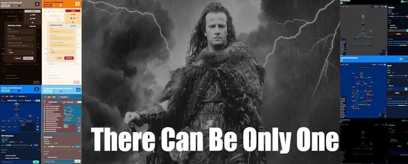
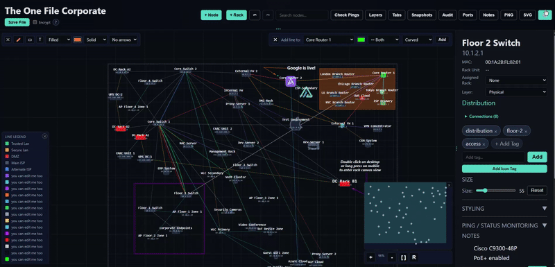
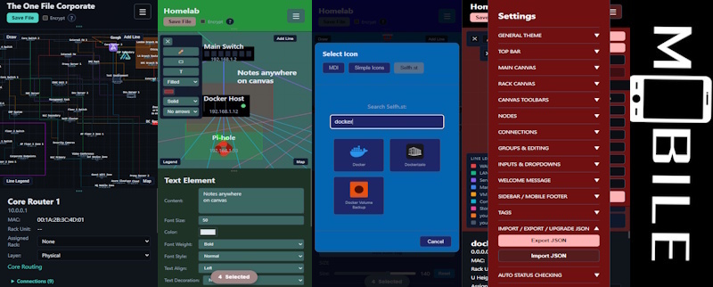

<p align="center">
  
  
  <a href="https://github.com/gelatinescreams/The-One-File/tree/main/theonefile_verse">
  
  </a>
</p>



There can only be One File. Map networks, smart homes, sports plays, mind maps, infrastructure or anything with nodes and connections. Animated zones, replay video export, enterprise encryption, full styling. Works offline, opens anywhere, saves into itself. 

*The Networkening edition adds live status monitoring and icons from [selfh.st/icons](https://selfh.st/icons/), [MDI](https://pictogrammers.com/library/mdi/), and [Simple Icons](https://simpleicons.org/).* Still one file. 

*TheOneFile_Verse adds an easily deployable, Docker based, real time collaboration wrapper that enables multiple users to create, edit and share together!

   

### Version 4.1.2 /\ 1-12-26 Image support, Notes Enhancements and Squashing Bugs
* **Image System**
  * New image upload icon added to toolbar
  * Drag and drop images added to canvas
* **Notes System Enhancements**
  * Added rich text editor to all notes
  * Added notes linking to main notes hub with notes search
  * Added search to all individual notes sections  
* **Bug Fixes**
  * Fixed Zone line style dropdown not applying.  Big thank you to legendary tester [mohacc2008-ctrl](https://github.com/mohacc2008-ctrl)
  * + many more see [changelog.md](changelog.md)

### Demos

* **Core Edition**
  * [Core: Corporation Demo](https://therecanonlybe.one/demos/?version=core&demo=corporate)
  * [Core: Homelab Demo](https://therecanonlybe.one/demos/?version=core&demo=homelab)
* **Networkening Edition**
  * [Networkening: Corporate Demo](https://therecanonlybe.one/demos/?version=networkening&demo=corporate)
  * [Networkening: Homelab Demo](https://therecanonlybe.one/demos/?version=networkening&demo=homelab)
* **TheOneFile_Verse Edition** 
  * [TheOneFile_Verse online demo](https://multiverse.therecanonlybe.one/s/b208667b-7a9e-4a18-ac98-5cb6e73bb669)
  * *join from different browsers to see real time changes*
  * [TheOneFile_Verse landing page](https://multiverse.therecanonlybe.one) 
  
  
### Core vs Networkening vs TheOneFile_Verse

| Feature | theonefile.html | theonefile-networkening.html | TheOneFile_Verse |
|---------|---------|--------|--------|
| All core features | ✓ | ✓ | ✓ |
| Create/edit/save topologies | ✓ | ✓ | ✓ |
| Shapes, lines, styling | ✓ | ✓ | ✓ |
| U slot rack topologies | ✓ | ✓ | ✓ |
| **Add text labels anywhere** | ✓ | ✓ | ✓ |
| **Draw rectangles/boxes** | ✓ | ✓ | ✓ |
| **Free draw custom lines** | ✓ | ✓ | ✓ |
| **Keyboard shortcuts** | ✓ | ✓ | ✓ |
| Encryption, export | ✓ | ✓ | ✓ |
| Bulk operations | ✓ | ✓ | ✓ |
| Multi select | ✓ | ✓ | ✓ |
| **AES 256 GCM encryption (OPTIONAL)** | ✓ | ✓ | ✓ |
| Live node search | ✓ | ✓ | ✓ |
| Per device styling | ✓ | ✓ | ✓ |
| Mobile optimized | ✓ | ✓ | ✓ |
| Offline only | ✓ |  | ✓ |
| No dependencies | ✓ |  | ✓ |
| **[MDI Icons](https://pictogrammers.com/library/mdi/)**       |  | ✓ | ✓ |
| **[Simple Icons](https://simpleicons.org/?q=ping)**   |  | ✓ | ✓ |
| **[selfh.st/icons](https://selfh.st/icons/)** |  | ✓ | ✓ |
| **Auto Status Checking** |  | ✓ | ✓ |
| **Live Ping/Health Status** |  | ✓ | ✓ |
| **Real time, multi user collaboration** |  | ✓ | ✓ |

### Docker & TheOneFile_Verse

```bash
docker run -d -p 10101:10101 -v theonefile-data:/app/data ghcr.io/gelatinescreams/theonefile_verse:latest
```

Or with docker compose, create a `docker-compose.yml`:

```yaml
services:
  theonefile_verse:
    image: ghcr.io/gelatinescreams/theonefile_verse:latest
    ports:
      - "10101:10101"
    volumes:
      - ./data:/app/data
    restart: unless-stopped
```

Then run:
```bash
docker compose up -d
```

Open `http://localhost:10101`

* [More information on TheOneFile_Verse](https://github.com/gelatinescreams/The-One-File/tree/main/theonefile_verse)

### Core + Networkening Editions Download:

* Core [the-one-file.html](https://github.com/user-attachments/files/24578723/the-one-file.html)
* Networkening [theonefile-networkening.html](https://github.com/user-attachments/files/24578724/theonefile-networkening.html)

### Why It Exists

I wanted a tool that is:

* fully offline
* portable
* zero setup
* stable
* fast
* dependable in emergencies

Instead of building another hosted application, I built a file.

### What You Can Use It For
* Homelab mapping  
* Office network layouts  
* Rack diagrams  
* VLAN and subnet planning  
* Mind Maps and flowcharts
* Annotated network documentation with labels and zones
* Logical and physical maps  
* Encrypted break glass documentation  
* Offline or air gapped environments  
* Sharing a topology by sending a single file

### Features
* Zero coding knowledge required    
* Zero config files
* Draw anywhere: add text labels, boxes, and custom lines to annotate your topology
* Full keyboard shortcut support for power users
* Advanced keyboard navigation with arrow keys, tab cycling, and focus controls
* Node locking to prevent accidental changes to positioned elements
* Node grouping to move related components together
* Touch optimized mobile interface with gesture support

### Canvas and Navigation
* Large zoomable and pannable workspace  
* Minimap with viewport tracking  
* Works with touch and mobile  
* Clear grid and boundary indicators
* Precise zoom controls with level display
* Right click context menu for quick actions
* **Free Draw Mode** Draw custom polylines, rectangles, and text labels anywhere:
  * Custom lines with points you place
  * Rectangles (filled or outlined) for zones/boundaries
  * Text labels with full styling (font, size, color, weight, alignment)
  * Customizable colors, line styles (solid/dashed/dotted), and arrows
* Keyboard shortcuts for power users (undo/redo, copy/paste, zoom controls, node navigation)
* **Arrow key nudging** for pixel perfect positioning (1px or 10px with Shift)
* **Tab cycling** to quickly navigate through all nodes
* **Focus key** to auto zoom to selected nodes

### Nodes
* Multiple shapes for common devices including servers, routers, switches, firewalls, and clouds  
* *Icon shapes from MDI, Simple Icons, and selfh.st/icons available in the theonefile-networkening.html version*
* Editable name, IP, role, tags, and notes
* *Editable icon shapes from MDI, Simple Icons, and selfh.st/icons available in the theonefile-networkening.html version*
* Resizable with full styling controls  
* Custom fonts, colors, and text offsets  
* **Per breakpoint styling** for desktop, tablet, mobile, and fold layouts : customize appearance independently for each screen size
* **Right click to clone** nodes with smart positioning
* **Multi select support** with click drag or right click selection
* **Lock nodes** to prevent accidental movement while editing
* **Group nodes** to move multiple related nodes as a single unit
* Visual indicators for locked and grouped nodes

#### Racks
* Create rack nodes to represent physical server racks
* Enter rack view by double clicking a rack node (or long press on mobile)
* Inside rack view, see a vertical rack with U unit markings
* Assign devices to specific U positions within racks
* Set device height in rack units (1U, 2U, 4U, etc.)
* Visual rack capacity indicator shows available vs used space
* Nodes assigned to racks appear in both topology and rack views
* Quick navigation: double tap empty space on mobile to exit rack view
* Automatic rack assignment when creating nodes while in rack view

### Layer System
* Choose between physical, logical, security and application layers for anything and easily toggle visibility between them
* Toggle layer visibility to focus on specific aspects of your topology
* Filter view to show only nodes and connections in selected layers
* Simplifies complex topologies by letting you focus on one aspect at a time

#### Lock and Group System
* **Lock individual or multiple nodes** to prevent accidental movement
  * Visual lock indicator appears on locked nodes
  * Locked nodes cannot be moved by mouse, touch, or keyboard
  * Keyboard shortcut (L) for quick lock/unlock
  * Works with multi selection for batch locking
  * Lock button in mobile multi select menu
* **Group nodes to move together**
  * Create groups of related nodes that move as a unit
  * Visual group indicator (dashed outline) on grouped nodes
  * Drag any member of a group to move all nodes in that group
  * Keyboard shortcut (G) to create/dissolve groups
  * Groups respect individual node lock status
  * Group button in mobile multi select menu
  * Perfect for logical grouping (clusters, zones, related infrastructure)

### Bulk Operations
* **Multi select nodes** for batch operations
* **Bulk Align**: Align selected nodes left, right, top, or bottom
* **Bulk Distribute**: Evenly space nodes horizontally or vertically
* **Bulk Clone**: Duplicate multiple nodes at once
* **Bulk Delete**: Remove multiple nodes simultaneously
* **Bulk Lock**: Lock or unlock multiple nodes at once
* **Bulk Group**: Create or dissolve node groups
* **Desktop and mobile toolbars** optimized for each platform

### Network Monitoring *(theonefile-networkening.html only)*
* **Live status indicators** on nodes (online/offline/checking)
* **Manual ping/status check** for individual nodes
* **Auto Status Checking** with configurable intervals (5-3600 seconds)
* Status check scheduling with next check timer
* Last run timestamp tracking
* Per node ping enable/disable settings
* Visual ping indicators with color coding

### Connections
* Smart routed lines between nodes
* Multiple links between the same devices  
* Optional direction arrows  
* Custom width, color, and labels  
* Port labels (e.g., eth0, gi0/1)
* Notes for VLANs, protocols, policies, and bandwidth  

### Legend (Bottom left)
* Can be hidden on both desktop and mobile
* Automatically built from line colors in use  
* Editable labels  
* note: only shows up after first line is generated.

### Save System
* Exports a brand new updated HTML file  
* All data is embedded in the file  
* Optional AES 256 GCM encryption for sensitive information  
* Browser native crypto only  
* No servers involved  
* *Version theonefile-networkening.html uses 3 server calls from cdn.jsdelivr.net to load icons*

### Security & Encryption
**Industry Standard Protection:**
* **AES 256 GCM** encryption (authenticated encryption with 256 bit keys)
* **PBKDF2** key derivation with:
  * 200,000 iterations (protection against brute force attacks)
  * SHA 256 hashing algorithm
  * Cryptographically secure random 16 byte salt per file
  * Unique 12 byte initialization vector (IV) per encryption
* **Browser native Web Crypto API** no third party encryption libraries
* **Zero server communication** all encryption/decryption happens locally in your browser
* **Password confirmation** required before saving encrypted files
* **Non recoverable** no backdoors, no password reset, no recovery options
  * If you forget your password, your data is permanently inaccessible
  * This is a feature, not a bug so your data stays protected
* **3 attempt limit** on decryption to prevent brute force attempts
* **Encrypted data format**: Salt + IV + ciphertext embedded directly in the HTML file

### Mobile Experience
* **Completely rewritten mobile UI** in version 3.0
* **Resizable mobile footer** with drag handle for custom panel sizing
* **Touch optimized controls** throughout the interface
* **Mobile bulk operations modal** for efficient multi node editing with Lock and Group buttons
* **Enhanced double tap gestures**:
  * Double tap nodes to select multiple (equivalent to right click on desktop)
  * Double tap to clone and align nodes
  * **NEW: Double tap empty space in rack view to quickly exit to topology view**
* Responsive layout that adapts to screen orientation
* Optimized for phones, tablets, and foldable devices
* Smart gesture detection prevents accidental actions during panning

### Keyboard Shortcuts

[keyboard-shortcuts.md](keyboard-shortcuts.md)

| Shortcut | Action |
|----------|--------|
| `Arrow Keys` | Move selected node(s) 1 pixel |
| `Shift + Arrow Keys` | Move selected node(s) 10 pixels |
| `Tab` | Cycle to next node |
| `Shift + Tab` | Cycle to previous node |
| `F` | Focus camera on selected node(s) |
| `L` | Lock/unlock selected node(s) |
| `G` | Group/ungroup selected nodes (requires 2+) |
| `Ctrl/Cmd + Z` | Undo |
| `Ctrl/Cmd + Y` | Redo |
| `Ctrl/Cmd + Shift + Z` | Redo (alternative) |
| `Ctrl/Cmd + C` | Copy selected node |
| `Ctrl/Cmd + V` | Paste node |
| `Ctrl/Cmd + D` | Duplicate selected node |
| `Ctrl/Cmd + A` | Select all nodes |
| `Ctrl/Cmd + Plus` | Zoom in |
| `Ctrl/Cmd + Minus` | Zoom out |
| `Ctrl/Cmd + 0` | Reset view |
| `Space + Drag` | Pan canvas |
| `Escape` | Clear selection |
| `Delete` | Delete selected item(s) |
| `Scroll` | Zoom in/out |
| `Shift + Click/Drag` | Multiple Select (marquee selection) |

## Recording

| Key | Action |
|-----|--------|
| R | Start/stop real time recording |
| Shift+R | Start/stop step by step recording |
| Space | Add step (step recording) / Play/Pause (playback) |
| P | Play recording |

### Mobile Gestures & Touch Controls

[mobile-gestures.md](mobile-gestures.md)

| Gesture | Action | Context |
|---------|--------|---------|
| **Double tap node** | Add to multi selection | Any view |
| **Double tap empty space** | Exit to topology view | Rack view only |
| **Long press rack node** | Enter rack view | Topology view |
| **Pinch** | Zoom in/out | Any view |
| **One finger drag (empty space)** | Pan canvas | Any view |
| **One finger drag (node)** | Move node | Any view |
| **Tap selected node** | Open properties panel | Any view |
| **Drag footer handle** | Resize mobile panel | Mobile only |

### Customization
* 100% control theme editor
* Per breakpoint node styling for responsive designs
* Custom color schemes and backgrounds
* Adjustable panel sizes and layouts

### Supported Browsers

* Chrome and Edge  
* Firefox  
* Safari desktop and mobile  
* Modern Android and iOS browsers  

If the browser is reasonably modern, it should work.

### Credits

Icon support for theonefile-networkening.html version powered by:
* [selfh.st/icons](https://selfh.st/icons/) : Popular self hosted icons
* [Material Design Icons](https://pictogrammers.com/library/mdi/) : 7,000+ open source icons
* [Simple Icons](https://simpleicons.org/) : Free SVG icons for popular brands

Thank you to all the icon creators and maintainers for making these resources freely available.
