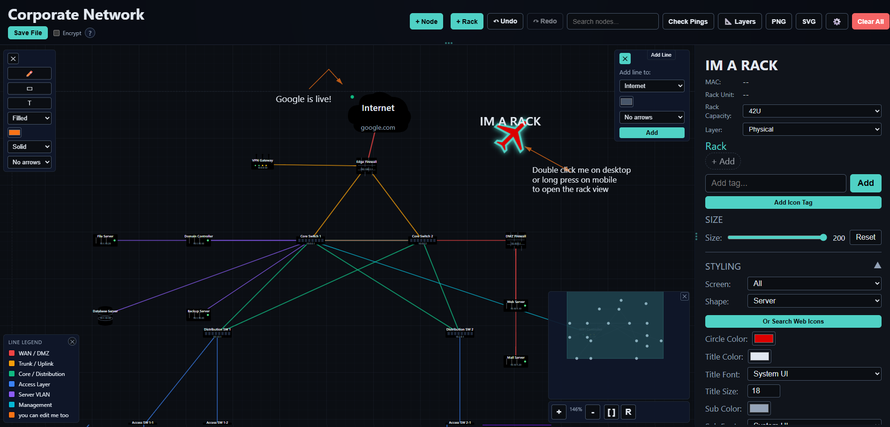
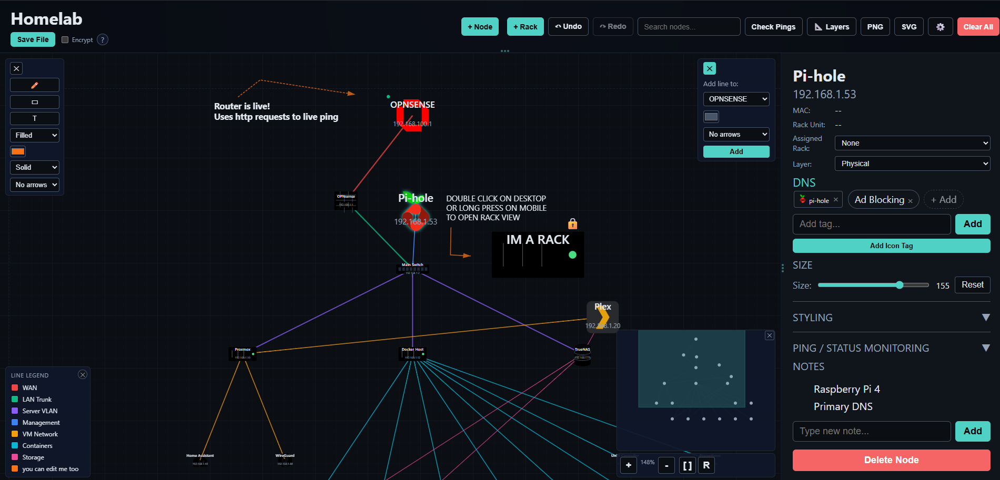

# The One File - Network Topology Maker

In the end there can only be "The ONE File". A portable and completely self contained network topology builder. The canvas, the logic, the settings, your nodes, your connections, and your notes all live inside a single standalone HTML file. Any modern browser can open and edit it without any prior setup. (is the idea)

*Two editions are now available with 3.0. Both built from the same core design.*
- **the-one-file.html**
A fully self contained topology builder that runs anywhere as a single standalone HTML file and the core of theonefile-networkening.html

- **theonefile-networkening.html**
  Which adds online features like live status/ping per node and icons from awesome libraries from MDI, Simple Icons, Selfh.st. It functions as a bolt-on layer while keeping the core workflow unchanged. Still one file!

  

## Version 3.1 - 12/1/25
- NEW 3.1 Desktop and mobile view fixes. *thank you discord testers*
- NEW 3.0 Total mobile rewrite for core the-one-file.html
- NEW 3.0 Total css rewrite for core the-one-file.html
- NEW 3.0 : Ping/Live status for nodes added to theonefile-networkening.html
- Online Demos:
- [the-one-file.html-corporate-demo.html](https://gelatinescreams.github.io/The-One-File/demos/the-one-file-corporate-demo.html)
- [the-one-file.html-homelab-demo.html](https://gelatinescreams.github.io/The-One-File/demos/the-one-file-homelab-demo.html)
#
- [theonefile-networkening-corporate-demo.html](https://gelatinescreams.github.io/The-One-File/demos/theonefile-networkening-corporate-demo.html)
- [theonefile-networkening-homelab-demo.html](https://gelatinescreams.github.io/The-One-File/demos/theonefile-networkening-homelab-demo.html)
- NEW 2.8 : Icon SEARCH with live preview
- Seperate online features version to include icons - OPTIONAL
- Use theonefile-networkening.html for this version
- Icon support added (MDI, Simple Icons, Selfh.st)
- Icons as node shapes
- Icons as tags on nodes

## Online vs Offline

| Feature | theonefile.html | theonefile-networkening.html |
|---------|---------|--------|
| All core features | ✓ | ✓ |
| Create/edit/save topologies | ✓ | ✓ |
| Shapes, lines, styling | ✓ | ✓ |
| Encryption, export | ✓ | ✓ |
| Offline only | ✓ |  |
| No dependencies | ✓ |  |
| **[MDI Icons](https://pictogrammers.com/library/mdi/)**       |  | ✓ |
| **[Simple Icons](https://simpleicons.org/?q=ping)**   |  | ✓ |
| **[Selfh.st Icons](https://selfh.st/icons/)** |  | ✓ |

# Demos

#### Online:
- [the-one-file-corporate-demo.html](https://gelatinescreams.github.io/The-One-File/demos/the-one-file-corporate-demo.html)
- [the-one-file-homelab-demo.html](https://gelatinescreams.github.io/The-One-File/demos/the-one-file-homelab-demo.html)
- [theonefile-networkening-corporate-demo.html](https://gelatinescreams.github.io/The-One-File/demos/theonefile-networkening-corporate-demo.html)
- [theonefile-networkening-homelab-demo.html](https://gelatinescreams.github.io/The-One-File/demos/theonefile-networkening-homelab-demo.html)

#### Download:

- [the-one-file.html](https://github.com/user-attachments/files/23866860/the-one-file.html)
- [theonefile-networkening.html](https://github.com/user-attachments/files/23866861/theonefile-networkening.html)
- [the-one-file-corporate-demo.html](https://github.com/user-attachments/files/23866862/the-one-file-corporate-demo.html)
- [the-one-file-homelab-demo.html](https://github.com/user-attachments/files/23866863/the-one-file-homelab-demo.html)
- [theonefile-networkening-corporate-demo.html](https://github.com/user-attachments/files/23866864/theonefile-networkening-corporate-demo.html)
- [theonefile-networkening-homelab-demo.html](https://github.com/user-attachments/files/23866865/theonefile-networkening-homelab-demo.html)

## Why It Exists

I wanted a tool that is:

- fully offline
- portable
- zero setup
- stable
- fast
- dependable in emergencies

Instead of building another hosted application, I built a file.

## What You Can Use It For
- Homelab mapping  
- Office network layouts  
- Rack diagrams  
- VLAN and subnet planning  
- Mind Maps
- Logical and physical maps  
- Encrypted break glass documentation  
- Offline or air gapped environments  
- Sharing a topology by sending a single file

## Features
- Zero coding knowledge required    
- Zero config files

### Canvas and Navigation
- Large zoomable and pannable workspace  
- Minimap with viewport tracking  
- Works with touch and mobile  
- Clear grid and boundary indicators  

### Nodes
- Multiple shapes for common devices including servers, routers, switches, firewalls, and clouds  
- *Icon shapes from MDI, Simple Icons, and Selfh.st available in the theonefile-networkening.html version*
- Editable name, IP, role, tags, and notes
- *Editable icon shapes from MDI, Simple Icons, and Selfh.st available in the theonefile-networkening.html version*
- Resizable with full styling controls  
- Custom fonts, colors, and text offsets  
- Per breakpoint styling for desktop, tablet, mobile, and fold layouts  

### Connections
- Smart routed lines  
- Multiple links between the same devices  
- Optional direction arrows  
- Custom width, color, and labels  
- Notes for VLANs, protocols, policies, and bandwidth  

### Free Draw
- Create custom polylines  
- Move and edit individual points  
- Useful for additional networks, zones, boundaries, etc

### Legend (Bottom left)
- Can be hidden on both desktop and mobile
- Automatically built from line colors in use  
- Editable labels  
- note: only shows up after first line is generated.

### Save System
- Exports a brand new updated HTML file  
- All data is embedded in the file  
- Optional AES 256 GCM encryption for sensitive information  
- Browser native crypto only  
- No servers involved  
- *Version theonefile-networkening.html uses 3 server calls from cdn.jsdelivr.net to load icons*

### Customization
- 100% control theme editor  

## Supported Browsers

- Chrome and Edge  
- Firefox  
- Safari desktop and mobile  
- Modern Android and iOS browsers  

If the browser is reasonably modern, it should work.

## Credits

Icon support for theonefile-networkening.html version powered by:
- [Selfh.st Icons](https://selfh.st/icons/) - Self-hosted app icons by the selfh.st community
- [Material Design Icons](https://pictogrammers.com/library/mdi/) - 7,000+ open source icons by Pictogrammers
- [Simple Icons](https://simpleicons.org/) - Free SVG icons for popular brands

Thank you to all the icon creators and maintainers for making these resources freely available. 
